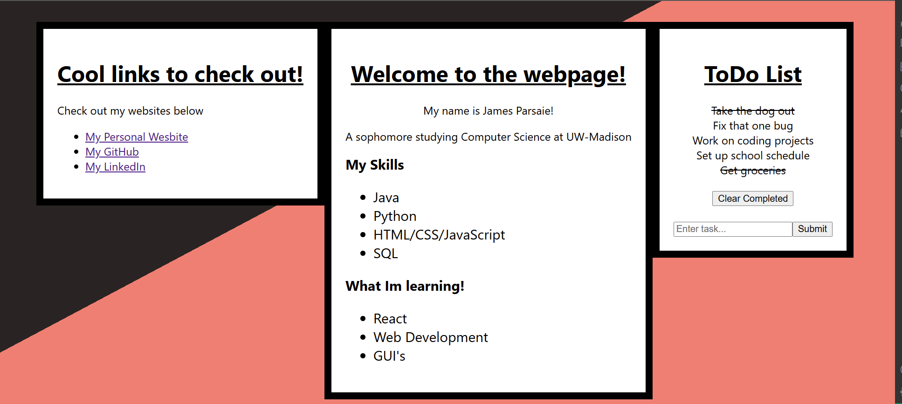

# Project Overview
I wished to learn these concepts as I want to pursue creating new web applications and wanted to incorporate React.
   Utilizing React will allow me to create highly dynamic webpages, and the ability to have reusable components streamlines
   a lot of the coding process. This project allowed me to further develop my experience with languages such as HTML, CSS, and JavaScript
 # Why do this?
 I wanted to learn what it took to create a web application myself will also utilizing the React library to create more dynamic webpages. More in particular I learned about compoent classes and the ways in which they can interact with eachother and pass information as props. It served for me to better understand how to create more concise code and reusing components I had already created.
 #
 <pre>
   A basic web page application I created to familiarize myself further with concepts such
       - HTML
       - CSS
       - JavaScript
       - React

   This webpage in particular is an overall very basic version of a React page. It had 3 main boxes one for linkes, another as a main landing
   and small piece on my coding experience, and finally a ToDo List. The ToDo list is the piece that makes the most use of the React components
   and its overall utilities.
  </pre>

  
